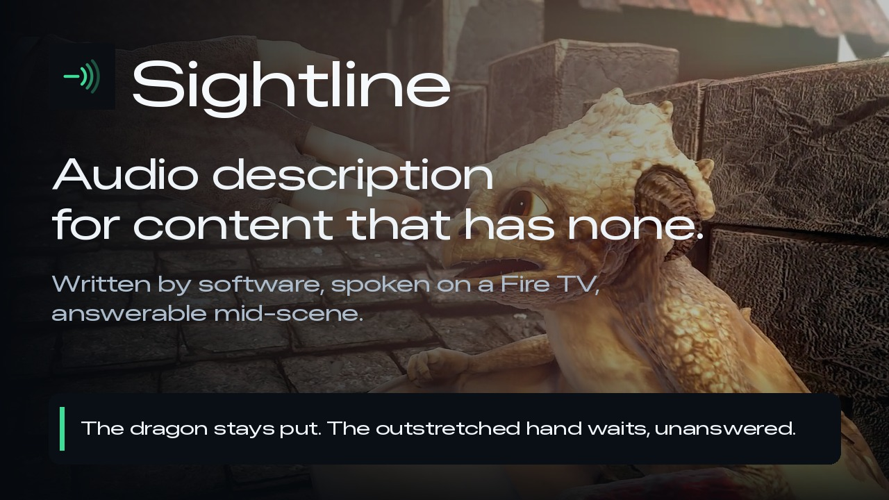
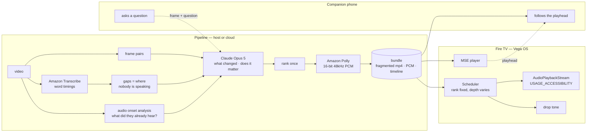

<div align="center">

<picture>
  <source media="(prefers-color-scheme: dark)" srcset="brand/sightline-mark-dark.svg">
  
</picture>

# Sightline

**Audio description for content that has none —<br>generated, spoken on your Fire TV, and answerable mid-scene.**

Build, Ship, Shape: Amazon Developer Hackathon 2026 · Fire TV (Vega OS) track

<br>

[**▶ Demo video (3 min)**](https://youtu.be/vqJsFDnj7ko) &nbsp;·&nbsp;
[**Live demo**](https://tushartechs.github.io/sightline/) &nbsp;·&nbsp;
[**Watch it work**](#watch-it-work) &nbsp;·&nbsp;
[**Try it yourself**](#try-it-without-a-fire-tv) &nbsp;·&nbsp;
[**vs a phone app**](#what-this-does-that-a-phone-app-pointed-at-a-screen-does-not) &nbsp;·&nbsp;
[**Architecture**](#architecture) &nbsp;·&nbsp;
[**Evidence**](#evidence) &nbsp;·&nbsp;
[**AWS**](#aws-integration) &nbsp;·&nbsp;
[**Where AI is used**](#where-ai-is-used-and-where-it-is-not) &nbsp;·&nbsp;
[**Why it works this way**](#how-we-knew-what-to-build) &nbsp;·&nbsp;
[**Limitations**](#limitations)

<br>

[](https://youtu.be/vqJsFDnj7ko)

**[Watch the three-minute demo](https://youtu.be/vqJsFDnj7ko)**

<br>

</div>

---

## For reviewers, in five minutes

The quickest way to check this is real rather than described:

| to see | open |
|---|---|
| **the whole thing in three minutes** | [the demo video](https://youtu.be/vqJsFDnj7ko) — the app on the device, a real generation run, and a question answered live |
| **that it works** | [the live demo](https://tushartechs.github.io/sightline/) — press play and listen |
| **that it runs on the device** | [`app/`](app/) — a real Vega OS app; [`probes/`](probes/) shows what the platform would and would not do |
| **that the numbers are real** | [Evidence](#evidence) — two of them reproduce with the commands given |
| **that the design is not guesswork** | [Why it works this way](#how-we-knew-what-to-build) — two blind reviewers, quoted directly, including the six faults one of them found |
| **that it works on a real story** | [three minutes of the film](https://tushartechs.github.io/sightline/film/) — the trailer withholds its story by design; this does not |
| **that it is not one hand-tuned clip** | three different videos described by the same pipeline — [a film](https://tushartechs.github.io/sightline/film/), [a 1951 instructional film](https://tushartechs.github.io/sightline/duck/), and the trailer |
| **where it does NOT work** | [`docs/where-it-works.md`](docs/where-it-works.md) — measured. An advert produces zero descriptions |
| **what the platform cost us** | [`FRICTION-LOG.md`](FRICTION-LOG.md) — 15 findings from building on Vega, written while building |
| **everything we would ask Amazon to fix** | [`FEEDBACK.md`](FEEDBACK.md) — 21 requests with priorities, plus what worked and what did not, per tool |
| **what we learned about Vega** | [`FRICTION-LOG.md`](FRICTION-LOG.md) (15 entries) and [`VEGA-FIELD-NOTES.md`](VEGA-FIELD-NOTES.md) |
| **what is not finished** | [`STATUS.md`](STATUS.md) — kept honest, including what no blind user has tested yet |
| **the Open Source entry** | [audio-description-qa](https://github.com/TusharTechs/audio-description-qa) — the blind-tester QA harness, released separately under MIT so anyone writing description can use it |

**Fastest check of all:** [tushartechs.github.io/sightline](https://tushartechs.github.io/sightline/) — press play and listen. Nothing to
install.

### How this maps to the judging criteria

| criterion | where to look |
|---|---|
| **Technological implementation** | [Architecture](#architecture) and [AWS integration](#aws-integration). Speech detection rather than silence detection, 2.5 usable seconds becoming 39.8. Every line measured against its gap before it is kept. A second audio stream on the device so description ducks the film rather than fighting it |
| **Design** | [Try it without a Fire TV](#try-it-without-a-fire-tv). Every control confirms itself aloud, because the user cannot see the HUD. VoiceView could not be enabled on the virtual device ([FL-011](FRICTION-LOG.md)), so the app speaks for itself |
| **Potential impact** | [How we knew what to build](#how-we-knew-what-to-build). Two blind reviewers, quoted directly. The co-viewing mode exists for one room: a blind viewer and a sighted viewer who want different things from the same screen |
| **Quality of the idea** | [What this does that a phone app pointed at a screen does not](#what-this-does-that-a-phone-app-pointed-at-a-screen-does-not), and [Limitations](#limitations). It describes what was never going to be described, and it says where it stops |
| **Friction log bonus** | [`FRICTION-LOG.md`](FRICTION-LOG.md), 15 entries, each with task, steps, expected against actual, severity, workaround and suggestion. Summarised with priorities in [`FEEDBACK.md`](FEEDBACK.md) |
| **AWS Builder mini challenge** | [AWS integration](#aws-integration). Transcribe, Polly, S3, Lambda and API Gateway, with measurements. Bedrock is included as a documented failure rather than omitted |
| **Open Source mini challenge** | [audio-description-qa](https://github.com/TusharTechs/audio-description-qa), MIT, created during the hackathon window |

## Where this sits against the Fire TV priority categories

Four of the six, and not by stretching. The two it does not touch are named
rather than skipped.

| category | how |
|---|---|
| **AI-enhanced viewing** | This is the whole project. Description that does not exist is written and spoken while you watch, for content no human describer was ever paid to cover. |
| **Multi-modal UX** | Voice out (a synthesised description track and spoken answers), voice in (hold to ask a question), D-pad for every control, on-screen captions for the room, and a second screen — the description can go to one person's phone while the television plays untouched. |
| **Computer vision** | Description is generated by diffing frame pairs across each gap and reasoning about what changed, not from metadata or subtitles. The same frame analysis answers questions about the moment you are on. |
| **Family entertainment** | The co-viewing mode exists for a specific room: a blind viewer and a sighted viewer watching the same screen, who want different things from it. Nothing else we found lets both have what they want at once. |
| ~~Sports~~ | Not targeted. Live content has no gaps to write into and no time to generate. |
| ~~Fitness~~ | Not targeted. |

---

## What this does that a phone app pointed at a screen does not

Apps exist that will describe an image or a video on a phone. This is a
different thing in four ways, and the combination is the point:

- **It runs on the television**, not on a second device held up to one. The
  description comes out of the same speakers as the film, on a Fire Stick.
- **It fits the gaps.** Description is placed where nobody is speaking and
  measured to fit before it is spoken, so it never talks over the dialogue.
  That requires knowing where the dialogue is, which is why Transcribe is in
  the pipeline rather than a silence detector.
- **It survives a speed change.** Ranking is fixed once, host-side. At 2x you
  hear less of the same story in the same order, never a different story — a
  rule a blind reviewer gave us and the single hardest constraint in here.
- **It can be interrupted.** A question about the frame on screen right now is
  answered from that frame. No pre-rendered description track can do this,
  because the question does not exist when the track is made.

And one thing it does that nothing else seems to: **the description can go to
one person's phone while the room hears the film untouched.** A blind viewer
and a sighted viewer watching the same screen want different things, and
every other approach makes one of them compromise.

---

## In thirty seconds

Most of what people watch has never been described. Not because description is
hard to write, but because somebody has to be paid to write it, title by title,
and nobody is paying for the long tail. Every existing AI tool in this space is
a service you send a catalogue to.

Sightline describes **what is on your television now**, for content nobody will
ever describe by hand — and because it runs at playback time rather than in a
batch job months earlier, you can interrupt it and ask a question.

| | |
|---|---|
| **Watches** | frame pairs — it describes what *changed*, not what is on screen |
| **Speaks** | in the gaps where nobody is talking, over music without hesitation |
| **Ranks** | once — so playing faster gives you less of the same story, never a different one |
| **Shares a room** | description goes to your phone while everyone else hears the film untouched |
| **Answers** | "who else is in this scene?" — from the frame you are actually on |

---

## Watch it work

**[▶ The three-minute demo video](https://youtu.be/vqJsFDnj7ko)** — the app running on
the Vega virtual device, a real generation run against a clip nothing had ever
described, and a question typed and answered live on a second screen.


Running on the Fire TV app. Every word was written by the system from what
changed on screen, placed where nobody is speaking, and measured to fit before
it was spoken.


*Nothing in that frame is in the dialogue or the soundtrack. The figure is a few
pixels across, and it is the shot.*

| | |
|---|---|
|  |  |
| Quiet during playback — the screen belongs to the film | Titles are described, but rank last: at speed they are the first thing dropped |

---

## Try it without a Fire TV

### ▶ [tushartechs.github.io/sightline](https://tushartechs.github.io/sightline/)

Open it on anything and press **Play with description**. No device, no SDK, no
install — the same timeline and the same generated audio that the Fire TV app
uses, driving a plain web page. About 6 MB, so it starts quickly on mobile data.

Built for a screen reader: large targets, one primary action, semantic
landmarks, and live regions that announce state changes without reading the
clock aloud. Several of those details are there because a blind reviewer
reported the earlier versions doing the wrong thing.

**Three more things worth opening, all linked from that page:**

### ▶ [/film/](https://tushartechs.github.io/sightline/film/) — three minutes of the actual film

The clip above is a trailer, and a trailer withholds its story deliberately.
A blind reviewer pointed out that made it a poor test: *"is it possible that
the information isn't enough to draw a line through it?"* This is the film
itself, where the story is present and the description can be judged on
whether it conveys one.

### ▶ [/duck/](https://tushartechs.github.io/sightline/duck/) — a 1951 civil defence film

Nine minutes, narrated almost end to end. A much harder case than a film,
because continuous narration leaves almost nowhere to speak — 77% of it is
dialogue against Sintel's 4.5%. It produces 11 descriptions in the gaps that
exist, and [`docs/where-it-works.md`](docs/where-it-works.md) measures where
that floor finally gives out.

### ▶ [/listen/](https://tushartechs.github.io/sightline/listen/) — can you hear what the machine hears?

Nineteen clips, scored in your browser, no data collected. Deciding whether a
noise is an event worth describing or just the score swelling was the hardest
problem in here; this is the test of whether the distinction is audible to a
listener at all. Three clips are played twice to measure your own consistency,
because a machine that changes its mind is only unreliable if it does so more
often than a person.

*Asking questions is not available on the hosted pages — answers are generated
from the frame on screen and need a server. The hosted page says so where the
feature would be, rather than hiding it. Run it locally for that.*

### Running the whole thing locally

One command after cloning, and this adds the question answering:

```bash
SIGHTLINE_BUNDLE=/path/to/bundle pipeline/.venv/bin/python companion/server.py
```

Then open `http://localhost:8190/` and press **Play with description**. You get
the film with generated description ducked over it, and the **Ask about this
moment** buttons work — the answer comes from the frame you are actually on.

On the same network, other devices can reach it at your machine's LAN address
(`http://192.168.x.x:8190/`) — useful for testing on a phone, but it is a
private address and will not work from anywhere else.

It is the product minus the television. The page is built for a screen reader:
large targets, one primary action, semantic landmarks, and an `aria-live` region
that announces state.

Pre-rendered clips, if you would rather just play a file:

| clip | what to listen for |
|---|---|
| [`sintel-described-1.0x.mp4`](docs/clips/sintel-described-1.0x.mp4) | eight generated descriptions placed between the lines of a real trailer |
| [`sintel-described-2.0x.mp4`](docs/clips/sintel-described-2.0x.mp4) | same story, fewer words — *"Now checked"* rather than *"The checkbox is now ticked"* |
| [`walkthrough-described.mp4`](docs/clips/walkthrough-described.mp4) | pause-and-explain mode on a software walkthrough |

---

## Architecture



<details>
<summary><b>Why each of those choices, with the evidence</b></summary>

**MSE, not URL mode.** `player.src = url` fails on this platform for every media
type, before it issues a network request. The same player plays the same footage
when the bytes are handed to it through `SourceBuffer`. Both probes are in
[`probes/`](probes/); the diagnosis is in
[`BUG-REPORT-media-playback.md`](BUG-REPORT-media-playback.md).

**`keplerscript-audio-lib`, not w3cmedia, for description.** Raw PCM gives
frame-accurate timing, which every gap budget depends on, and
`USAGE_ACCESSIBILITY` makes the platform duck the film for us. It also needs no
media server, so the description channel was never blocked by the bug above.

**Speech detection, not silence detection.** Looking for silence finds 2.5
usable seconds in a 52-second trailer, because the score never stops. Detecting
*speech* and treating everything else as available finds **42.9 seconds**. A 17x
difference, and the reason is that describers talk over music all the time —
what they avoid is dialogue.

**Ranking fixed, depth variable.** Assigning descriptions to whichever gap fell
nearby meant that at 1x you learned one thing and at 2x a different thing. Rank
is now decided once and speed only changes how far down the list you get.

</details>

---

## How we knew what to build

Almost every design decision here came from correspondence with blind
reviewers on the ACB Audio Description Project mailing list — not from guesses
about what blind viewers want. Two of them, and they did different jobs.

**A blind accessibility professional** set the description rules, and kept
correcting them long after they looked settled:

> **"A walkthrough needs you to describe what changed, not what's there.
> The information lives in the difference between two moments."**
> → the pipeline diffs frame pairs; it never describes a single frame.

> **"A change matters when it changes what you can do next."**
> → the salience filter, and the same rule decides when to pause.

> **"Take the ranking off the clock. Same order every time. More of it at 1x,
> less at 2x. What I can't live with is a different story at a different speed."**
> → ranking is fixed host-side; the device never reorders.

> **"Don't spend words telling me something got skipped. Words are the thing you
> haven't got. Use a sound."**
> → a 140ms two-tone fall, not a sentence.

> **"The change I can't hear beats the change I can. The soundtrack is already
> doing half your job. Spend the gap on what's silent."**
> → onset analysis tells the model which moments were already audible.

> **"It isn't that it's camera language. It's that I can't use it."**
> → the ban is a usability test, not a vocabulary list.

> **"A swell and a hit are different shapes, not different sizes. Measure how
> fast the level got there rather than how far it got."**
> → onset detection measures attack and decay, not magnitude. Following his
> next correction — measure the fall against the level *before* the onset, not
> against the peak — separated hits from swells cleanly, and the perturbation
> test he then insisted on found a bug in the audio **loader**: it was reading
> 16-bit and clipping every file, turning impacts into swells before the rule
> ever saw them.

**Dave Matters** used the player and found what no amount of local testing
had:

> **"It goes well until just after the 2 minute mark. I get no further
> description after that."**
> → a limit meant to cap how many descriptions get written was truncating the
> film instead. On a feature it would have described the first minute and gone
> silent for the remaining thirteen. Invisible on a 52-second trailer, which
> is all that had ever been tested.

> **"The description was drown out by the video volume."**
> → `volume` is read-only on iOS, so ducking silently did nothing on exactly
> the devices most likely to be running a screen reader. The film now routes
> through a gain node.

> **"VO repeating things over and over… even when returning to the homescreen."**
> → a live region rewritten four times a second, and a transcript that
> prepended each new line so the reader's cursor was shoved out from under it.

> **"Is that a pan up to that perspective kind of shot? Just trying to
> construct it in my head."**
> → there was nobody there. A high shot through rafters had been described as
> "someone watches her sleep". It had turned a camera angle into a person, and
> a listener cannot check an invented character against the picture.

[`pipeline/src/preflight.py`](pipeline/src/preflight.py) now fails a clip
before anyone hears it, for each class of fault above that can be detected
mechanically.

**They disagreed about one thing**, which is why it is a setting rather than a
rule: whether to describe the filmmaking. One said camera vocabulary is
unusable; the other enjoys directorial style and wanted it. The research finds
most blind and partially sighted viewers prefer the cinematic style, so
`--cinematic` exists and is off by default.

---

## Evidence

| claim | measured |
|---|---|
| Finds the moments something changed | **9/9** ground-truth changes, **0** false positives |
| Applies the salience rule correctly | precision **1.00**, recall **1.00** |
| Fits descriptions to the gap at speed | verified by synthesis at 1x, 1.5x, 2x — nothing time-compressed |
| Finds describable time in real film | **39.8s** of a 52s trailer, vs 2.5s by silence detection |
| Plays video on Fire TV | MSE reaches `canplay` → `playing`, audio audible |
| Plays description concurrently | PCM on an accessibility stream, ducking confirmed |

Reproduce the first two:

```bash
cd pipeline
.venv/bin/python src/detect_changes.py fixtures/walkthrough/frames --fps 8 --out out/changes.json
.venv/bin/python src/evaluate.py fixtures/walkthrough/ground-truth.json --judged out/judged.json
```

**Honest caveat, stated because it matters:** that fixture is synthetic and we
wrote it, so a perfect score shows the pipeline implements the rule faithfully —
not that the rule generalises. The film results are on real footage; the
walkthrough results are not.

---

## Run it

Everything here runs on **macOS, Linux and Windows**. The pipeline and the
companion service are plain Python with no platform specific calls, and the app
is built with the Vega CLI, which Amazon ships for all three.

The only macOS specific things in this repository are the two scripts in
`tools/` used to record the demo video. They are not needed to run, build or
evaluate anything.

### What you need

| | |
|---|---|
| Python | 3.10 or newer |
| ffmpeg | on your `PATH`. `brew install ffmpeg`, `sudo apt install ffmpeg`, or `winget install ffmpeg` |
| AWS credentials | for Transcribe and Polly, if you want to generate a description from scratch |
| Vega SDK and CLI | only for the device app. Not needed for the pipeline or the web player |

<details>
<summary><b>Pipeline only, no Fire TV needed</b></summary>

**macOS and Linux**

```bash
cd pipeline
python3 -m venv .venv
.venv/bin/pip install anthropic boto3 pillow numpy
export ANTHROPIC_API_KEY=...            # or write it to ~/.config/sightline-anthropic-key

.venv/bin/python src/detect_speech.py video.mp4 --cache out/t.json --out out/gaps.json
.venv/bin/python src/film_cues.py video.mp4 out/gaps.json --transcript out/t.json --out out/cues.json
.venv/bin/python src/export_device_bundle.py out/cues.json video.mp4 --gaps out/gaps.json --out /tmp/bundle
.venv/bin/python src/render_from_bundle.py /tmp/bundle --rate 1.0 --out out/described.mp4
```

**Windows, PowerShell**

```powershell
cd pipeline
py -3 -m venv .venv
.venv\Scripts\pip install anthropic boto3 pillow numpy
$env:ANTHROPIC_API_KEY = "..."

.venv\Scripts\python src\detect_speech.py video.mp4 --cache out\t.json --out out\gaps.json
.venv\Scripts\python src\film_cues.py video.mp4 out\gaps.json --transcript out\t.json --out out\cues.json
.venv\Scripts\python src\export_device_bundle.py out\cues.json video.mp4 --gaps out\gaps.json --out $env:TEMP\bundle
.venv\Scripts\python src\render_from_bundle.py $env:TEMP\bundle --rate 1.0 --out out\described.mp4
```

Requires AWS credentials for Transcribe and Polly. If your network inspects
TLS, set `SIGHTLINE_CA_BUNDLE` to your corporate bundle; boto3 does not read
`SSL_CERT_FILE`, which is its own small trap.
</details>

<details>
<summary><b>On the Fire TV virtual device</b></summary>

Paths below are POSIX. On Windows use `.venv\Scripts\python` and `$env:TEMP`
in place of `/tmp`, as above.

```bash
# 1. build a bundle (above), plus the app's own voice
cd pipeline && .venv/bin/python src/build_ui_voice.py --out /tmp/bundle

# 2. serve it, and the companion phone page
SIGHTLINE_BUNDLE=/tmp/bundle pipeline/.venv/bin/python companion/server.py

# 3. build, install, run
cd app && npm install && npm run build:debug
vega virtual-device start
vega device install-app -p build/aarch64-debug/sightline_aarch64.vpkg
vega device launch-app -a com.sightline.tv.main
```

Then open `http://<your-lan-ip>:8190/` on a phone on the same network and press
**Follow a Fire TV instead**.

**Remote:** Select plays and pauses · Right changes speed · Up switches mode ·
Down moves description to the phone · Menu speaks the controls.
</details>

<details>
<summary><b>Nothing installed at all</b></summary>

[tushartechs.github.io/sightline](https://tushartechs.github.io/sightline/)
runs the same timeline and the same generated audio in any browser, on any
operating system. Press **Play with description**.
</details>

---

## Where AI is used, and where it is not

Judges should be able to tell these apart, so they are separated here.

**AI is the product, in three places.** These are not development aids, they
are what the thing does:

| | |
|---|---|
| Writing the descriptions | A vision language model reads frame pairs from each gap and writes the line. This is the core of the project |
| Answering questions | The same model, given the frame you are on plus the dialogue and descriptions so far |
| Speech and timing | Amazon Polly speaks every line, Amazon Transcribe supplies the word timings that define the gaps |

**AI assisted the development**, as a coding assistant, the way most software
is now written. It wrote code under direction and was corrected constantly.

**What is not AI, and is the actual work:**

- **Choosing the problem, and checking it was real.** Audio description does
  not exist for most video because someone has to be paid to write it.
- **The rules the descriptions follow.** These came from blind reviewers on the
  [ACB Audio Description Project](https://www.acb.org/adp/) mailing list, not
  from a model and not from me. Nothing during dialogue, nothing that repeats
  the soundtrack, never "the camera pans".
- **The architecture.** Detecting speech rather than silence, which turned 2.5
  usable seconds into 39.8. Ranking descriptions so the right ones survive at
  speed. Measuring every line against its gap before keeping it.
- **Finding out where it fails.** The measurements in
  [`docs/where-it-works.md`](docs/where-it-works.md), including the advert that
  correctly produces nothing.
- **Getting it tested by blind users, and acting on what came back.** Two
  reviewers, six faults, all fixed, and a QA harness released so the next
  person does not repeat them.
- **The fifteen findings in [`FRICTION-LOG.md`](FRICTION-LOG.md)**, written
  while building.

A model can write a line of description. It cannot tell you that the line is
wrong because a blind viewer does not care where the camera is.

---

## AWS integration

Three AWS services do real work in the pipeline — not decoration, and each
earned its place by solving a specific problem.

### Amazon Transcribe — finding where description can go

`pipeline/src/detect_speech.py`

The first version of this looked for **silence**. On a real trailer that finds
2.5 usable seconds in 52, because the score never stops, and it would make film
description essentially impossible. But describers talk over music constantly —
what they avoid is dialogue.

Transcribe's word-level timestamps give the speech intervals directly;
everything else is available. **2.5 seconds became 42.9.** A 17x difference, and
the single most consequential correction in the project.

It also returns the dialogue text, which is fed to the model so a description
never repeats a line the viewer just heard.

```python
tr.start_transcription_job(TranscriptionJobName=job,
                           Media={"MediaFileUri": f"s3://{bucket}/{key}"},
                           MediaFormat="mp3", LanguageCode="en-US")
```

### Amazon Polly — the description voice

`pipeline/src/speech.py`

Generative engine, falling back to neural where a voice or region lacks it.
Chosen over the platform's own speech for three reasons: it is portable (the
alternative was macOS-only, and this project has to build elsewhere), the
generative voices are markedly better, and it returns **PCM natively** — which
is exactly what `AudioPlaybackStream.writeAsync()` takes on Vega.

Two things we learned the hard way and corrected in code:

- **Polly pads both ends with silence**, and in fit-the-gaps mode that padding is
  charged against the gap budget. It is trimmed before measurement.
- **The speaking rate has to be measured, not assumed.** We guessed 170 wpm;
  once the padding is trimmed the voice delivers **203**. Every line overflowed
  its gap until we measured. `python3 src/speech.py calibrate` re-derives it.

### Amazon S3 — media staging

Transcribe reads its input from S3, so audio is uploaded, transcribed and the
object deleted in the same call. The bucket is private with public access
blocked.

### What is deliberately not AWS

Bedrock. It is refused at the account level on this account —
`Error 002: Access to Bedrock models is not allowed for this account`, in every
region, for every model, while S3, Polly and Transcribe all work on the same
credentials. The Bedrock client is written and shipped
(`pipeline/src/salience.py`, `--backend bedrock`, using `AnthropicBedrockMantle`)
and the first-party API is used instead. The diagnosis is in
[`STATUS.md`](STATUS.md).

## What is in here

| | |
|---|---|
| [`app/`](app/) | the Vega OS Fire TV app |
| [`pipeline/`](pipeline/) | description generation, evaluation, rendering |
| [`companion/`](companion/) | phone channel and the question endpoint |
| [`probes/`](probes/) | minimal apps that isolate what works on this platform |
| [`FRICTION-LOG.md`](FRICTION-LOG.md) | 14 entries on developing for Vega |
| [`VEGA-FIELD-NOTES.md`](VEGA-FIELD-NOTES.md) | practical notes for other developers |
| [`STATUS.md`](STATUS.md) | what is done and what is not, honestly |

---

## What we learned building on Vega

[`FRICTION-LOG.md`](FRICTION-LOG.md) has 14 entries from real work, and
[`VEGA-FIELD-NOTES.md`](VEGA-FIELD-NOTES.md) is the developer-facing companion —
the things that cost us days and are in neither the documentation nor the forum.
The sharpest: **`vega device run-cmd` is a sandboxed app context**, so platform
probes run from it return confident false negatives. Three of them told us the
device had no audio while it was playing an audible boot chime.

We also filed the media playback bug upstream with a controlled reproduction
([topic 29117](https://community.amazondeveloper.com/t/audioplayer-url-mode-fails-with-media-err-src-not-supported-on-vvd-app-never-connects-to-com-amazon-media-server-both-official-media-samples-also-fail/29117)).

---

## Limitations

Kept current in [`STATUS.md`](STATUS.md). The ones worth knowing before you judge:

- **Description is generated ahead of playback**, not live as you watch.
  Questions *are* answered live. Generating once for content nobody will ever
  describe by hand is the design; we would rather say so than imply otherwise.
- **Blind reviewers have used the web player, not the Fire TV app.** They
  found six faults in it, all fixed. The pipeline faults among them — the
  truncated timeline, the invented character — affect the television app
  equally, because it is the same generated description. The iOS-specific ones
  do not. Nobody blind has operated the app on a television.
- **It describes what it is left room to describe.** Measured across three
  content types in [`docs/where-it-works.md`](docs/where-it-works.md): an
  advert produces zero descriptions, because it fills every second it paid
  for. Gap-filling has a floor and this is where it is.
- **It does not understand the film.** It describes moments accurately and
  does not connect them. A reviewer asked what the dagger meant; no amount of
  better description answers that.
- Answers take about 7 seconds.
- Never run on physical Fire TV hardware — the virtual device only.

---

## Licence

MIT — see [LICENSE](LICENSE).

**Required attribution.** Demo footage is *Sintel*, © Blender Foundation,
[durian.blender.org](https://durian.blender.org), licensed **CC-BY 3.0**. Any
video using this footage must carry that credit. Full details in
[attribution/CREDITS.md](attribution/CREDITS.md).

**Built with** — not an attribution requirement, listed because it is the first
thing anyone evaluating this asks: Amazon Transcribe for speech timings, Amazon
Polly for the description voice, and Claude Opus 5 for the descriptions and the
answers.
