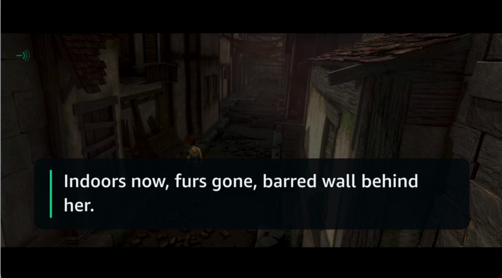
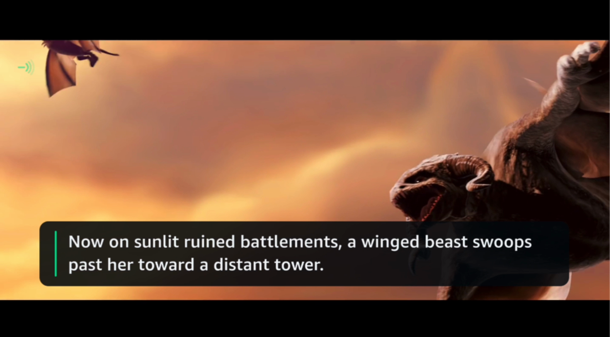
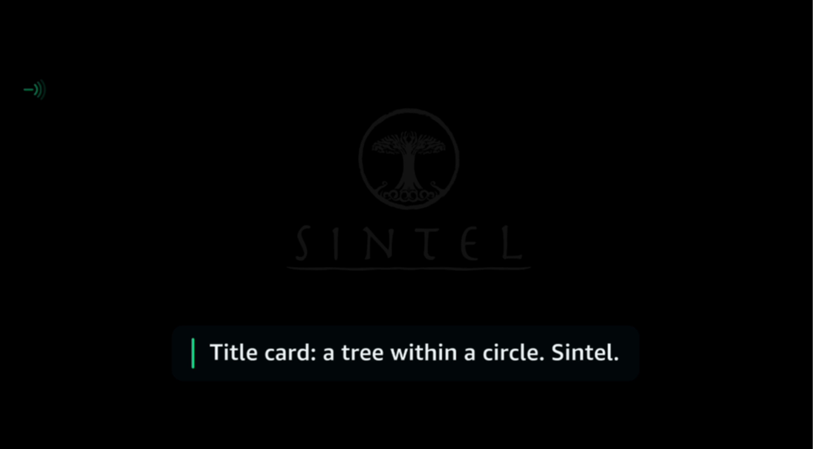
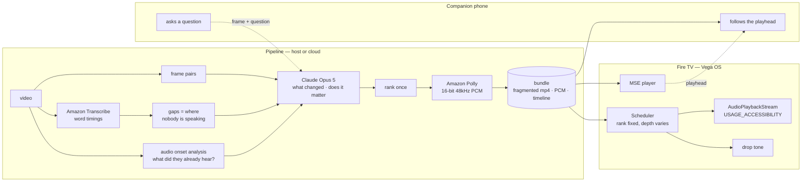

<div align="center">

<picture>
  <source media="(prefers-color-scheme: dark)" srcset="brand/sightline-mark-dark.svg">
  
</picture>

# Sightline

**Audio description for content that has none —<br>generated, spoken on your Fire TV, and answerable mid-scene.**

Build, Ship, Shape: Amazon Developer Hackathon 2026 · Fire TV (Vega OS) track

<br>

[**▶ Live demo**](https://d1ie12b84zbad7.cloudfront.net) &nbsp;·&nbsp;
[**Watch it work**](#watch-it-work) &nbsp;·&nbsp;
[**Try it yourself**](#try-it-without-a-fire-tv) &nbsp;·&nbsp;
[**Architecture**](#architecture) &nbsp;·&nbsp;
[**Evidence**](#evidence) &nbsp;·&nbsp;
[**AWS**](#aws-integration) &nbsp;·&nbsp;
[**Why it works this way**](#how-we-knew-what-to-build) &nbsp;·&nbsp;
[**Limitations**](#limitations)

<br>

</div>

---

## For reviewers, in five minutes

The quickest way to check this is real rather than described:

| to see | open |
|---|---|
| **that it works** | [the live demo](https://d1ie12b84zbad7.cloudfront.net) — press play and listen |
| **that it runs on the device** | [`app/`](app/) — a real Vega OS app; [`probes/`](probes/) shows what the platform would and would not do |
| **that the numbers are real** | [Evidence](#evidence) — two of them reproduce with the commands given |
| **that the design is not guesswork** | [Why it works this way](#how-we-knew-what-to-build) — the rules came from a blind accessibility professional, quoted directly |
| **what we learned about Vega** | [`FRICTION-LOG.md`](FRICTION-LOG.md) (15 entries) and [`VEGA-FIELD-NOTES.md`](VEGA-FIELD-NOTES.md) |
| **what is not finished** | [`STATUS.md`](STATUS.md) — kept honest, including what no blind user has tested yet |

**Fastest check of all:** [d1ie12b84zbad7.cloudfront.net](https://d1ie12b84zbad7.cloudfront.net) — press play and listen. Nothing to
install. The submission video is not made yet.

## In thirty seconds

Most of what people watch has never been described. Not because description is
hard to write, but because somebody has to be paid to write it, title by title,
and nobody is paying for the long tail. Every existing AI tool in this space is
a service you send a catalogue to.

Sightline describes **what is on your television now**, for content nobody will
ever describe by hand — and because it runs at playback time rather than in a
batch job months earlier, you can interrupt it and ask a question.

| | |
|---|---|
| **Watches** | frame pairs — it describes what *changed*, not what is on screen |
| **Speaks** | in the gaps where nobody is talking, over music without hesitation |
| **Ranks** | once — so playing faster gives you less of the same story, never a different one |
| **Shares a room** | description goes to your phone while everyone else hears the film untouched |
| **Answers** | "who else is in this scene?" — from the frame you are actually on |

---

## Watch it work


Running on the Fire TV app. Every word was written by the system from what
changed on screen, placed where nobody is speaking, and measured to fit before
it was spoken.



*Nothing in that frame is in the dialogue or the soundtrack. The figure is a few
pixels across, and it is the shot.*

| | |
|---|---|
|  |  |
| Quiet during playback — the screen belongs to the film | Titles are described, but rank last: at speed they are the first thing dropped |

---

## Try it without a Fire TV

### ▶ [d1ie12b84zbad7.cloudfront.net](https://d1ie12b84zbad7.cloudfront.net)

Open it on anything and press **Play with description**. No device, no SDK, no
install — the same timeline and the same generated audio that the Fire TV app
uses, driving a plain web page. About 6 MB, so it starts quickly on mobile data.

Built for a screen reader: large targets, one primary action, semantic
landmarks, and an `aria-live` region that announces state.

*Asking questions is not available on the hosted version — answers are generated
live and need a server. Run it locally for that.*

### Running the whole thing locally

One command after cloning, and this adds the question answering:

```bash
SIGHTLINE_BUNDLE=/path/to/bundle pipeline/.venv/bin/python companion/server.py
```

Then open `http://localhost:8190/` and press **Play with description**. You get
the film with generated description ducked over it, and the **Ask about this
moment** buttons work — the answer comes from the frame you are actually on.

On the same network, other devices can reach it at your machine's LAN address
(`http://192.168.x.x:8190/`) — useful for testing on a phone, but it is a
private address and will not work from anywhere else.

It is the product minus the television. The page is built for a screen reader:
large targets, one primary action, semantic landmarks, and an `aria-live` region
that announces state.

Pre-rendered clips, if you would rather just play a file:

| clip | what to listen for |
|---|---|
| [`sintel-described-1.0x.mp4`](docs/clips/sintel-described-1.0x.mp4) | eight generated descriptions placed between the lines of a real trailer |
| [`sintel-described-2.0x.mp4`](docs/clips/sintel-described-2.0x.mp4) | same story, fewer words — *"Now checked"* rather than *"The checkbox is now ticked"* |
| [`walkthrough-described.mp4`](docs/clips/walkthrough-described.mp4) | pause-and-explain mode on a software walkthrough |

---

## Architecture



<details>
<summary><b>Why each of those choices, with the evidence</b></summary>

**MSE, not URL mode.** `player.src = url` fails on this platform for every media
type, before it issues a network request. The same player plays the same footage
when the bytes are handed to it through `SourceBuffer`. Both probes are in
[`probes/`](probes/); the diagnosis is in
[`BUG-REPORT-media-playback.md`](BUG-REPORT-media-playback.md).

**`keplerscript-audio-lib`, not w3cmedia, for description.** Raw PCM gives
frame-accurate timing, which every gap budget depends on, and
`USAGE_ACCESSIBILITY` makes the platform duck the film for us. It also needs no
media server, so the description channel was never blocked by the bug above.

**Speech detection, not silence detection.** Looking for silence finds 2.5
usable seconds in a 52-second trailer, because the score never stops. Detecting
*speech* and treating everything else as available finds **42.9 seconds**. A 17x
difference, and the reason is that describers talk over music all the time —
what they avoid is dialogue.

**Ranking fixed, depth variable.** Assigning descriptions to whichever gap fell
nearby meant that at 1x you learned one thing and at 2x a different thing. Rank
is now decided once and speed only changes how far down the list you get.

</details>

---

## How we knew what to build

Almost every design decision here came from correspondence with a blind
accessibility professional on the ACB Audio Description Project mailing list —
not from our guesses about what blind viewers want.

> **"A walkthrough needs you to describe what changed, not what's there.
> The information lives in the difference between two moments."**
> → the pipeline diffs frame pairs; it never describes a single frame.

> **"A change matters when it changes what you can do next."**
> → the salience filter, and the same rule decides when to pause.

> **"Take the ranking off the clock. Same order every time. More of it at 1x,
> less at 2x. What I can't live with is a different story at a different speed."**
> → ranking is fixed host-side; the device never reorders.

> **"Don't spend words telling me something got skipped. Words are the thing you
> haven't got. Use a sound."**
> → a 140ms two-tone fall, not a sentence.

> **"The change I can't hear beats the change I can. The soundtrack is already
> doing half your job. Spend the gap on what's silent."**
> → onset analysis tells the model which moments were already audible.

> **"It isn't that it's camera language. It's that I can't use it."**
> → the ban is a usability test, not a vocabulary list.

The full exchange, including the four corrections that changed the
architecture, is in [`HANDOFF.md`](HANDOFF.md) and [`outreach/`](outreach/).

---

## Evidence

| claim | measured |
|---|---|
| Finds the moments something changed | **9/9** ground-truth changes, **0** false positives |
| Applies the salience rule correctly | precision **1.00**, recall **1.00** |
| Fits descriptions to the gap at speed | verified by synthesis at 1x, 1.5x, 2x — nothing time-compressed |
| Finds describable time in real film | **42.9s** of a 52s trailer, vs 2.5s by silence detection |
| Plays video on Fire TV | MSE reaches `canplay` → `playing`, audio audible |
| Plays description concurrently | PCM on an accessibility stream, ducking confirmed |

Reproduce the first two:

```bash
cd pipeline
.venv/bin/python src/detect_changes.py fixtures/walkthrough/frames --fps 8 --out out/changes.json
.venv/bin/python src/evaluate.py fixtures/walkthrough/ground-truth.json --judged out/judged.json
```

**Honest caveat, stated because it matters:** that fixture is synthetic and we
wrote it, so a perfect score shows the pipeline implements the rule faithfully —
not that the rule generalises. The film results are on real footage; the
walkthrough results are not.

---

## Run it

<details>
<summary><b>Pipeline only — no Fire TV needed</b></summary>

```bash
cd pipeline
python3 -m venv .venv && .venv/bin/pip install anthropic boto3 pillow numpy
export ANTHROPIC_API_KEY=...            # or ~/.config/sightline-anthropic-key

# film: find where nobody is speaking, describe the changes, render a clip
.venv/bin/python src/detect_speech.py video.mp4 --cache out/t.json --out out/gaps.json
.venv/bin/python src/film_cues.py video.mp4 out/gaps.json --transcript out/t.json --out out/cues.json
.venv/bin/python src/export_device_bundle.py out/cues.json video.mp4 --gaps out/gaps.json --out /tmp/bundle
.venv/bin/python src/render_from_bundle.py /tmp/bundle --rate 1.0 --out out/described.mp4
```

Requires AWS credentials for Transcribe and Polly.
</details>

<details>
<summary><b>On the Fire TV virtual device</b></summary>

```bash
# 1. build a bundle (above), plus the app's own voice
cd pipeline && .venv/bin/python src/build_ui_voice.py --out /tmp/bundle

# 2. serve it, and the companion phone page
SIGHTLINE_BUNDLE=/tmp/bundle pipeline/.venv/bin/python companion/server.py

# 3. build, install, run
cd app && npm install && npm run build:debug
vega virtual-device start
vega device install-app -p build/aarch64-debug/sightline_aarch64.vpkg
vega device launch-app -a com.sightline.tv.main
```

Then open `http://<your-lan-ip>:8190/` on a phone on the same network.

**Remote:** Select plays/pauses · Right changes speed · Up switches mode ·
Down moves description to the phone · Menu speaks the controls.
</details>

---

---

## AWS integration

Three AWS services do real work in the pipeline — not decoration, and each
earned its place by solving a specific problem.

### Amazon Transcribe — finding where description can go

`pipeline/src/detect_speech.py`

The first version of this looked for **silence**. On a real trailer that finds
2.5 usable seconds in 52, because the score never stops, and it would make film
description essentially impossible. But describers talk over music constantly —
what they avoid is dialogue.

Transcribe's word-level timestamps give the speech intervals directly;
everything else is available. **2.5 seconds became 42.9.** A 17x difference, and
the single most consequential correction in the project.

It also returns the dialogue text, which is fed to the model so a description
never repeats a line the viewer just heard.

```python
tr.start_transcription_job(TranscriptionJobName=job,
                           Media={"MediaFileUri": f"s3://{bucket}/{key}"},
                           MediaFormat="mp3", LanguageCode="en-US")
```

### Amazon Polly — the description voice

`pipeline/src/speech.py`

Generative engine, falling back to neural where a voice or region lacks it.
Chosen over the platform's own speech for three reasons: it is portable (the
alternative was macOS-only, and this project has to build elsewhere), the
generative voices are markedly better, and it returns **PCM natively** — which
is exactly what `AudioPlaybackStream.writeAsync()` takes on Vega.

Two things we learned the hard way and corrected in code:

- **Polly pads both ends with silence**, and in fit-the-gaps mode that padding is
  charged against the gap budget. It is trimmed before measurement.
- **The speaking rate has to be measured, not assumed.** We guessed 170 wpm;
  once the padding is trimmed the voice delivers **203**. Every line overflowed
  its gap until we measured. `python3 src/speech.py calibrate` re-derives it.

### Amazon S3 — media staging

Transcribe reads its input from S3, so audio is uploaded, transcribed and the
object deleted in the same call. The bucket is private with public access
blocked.

### What is deliberately not AWS

Bedrock. It is refused at the account level on this account —
`Error 002: Access to Bedrock models is not allowed for this account`, in every
region, for every model, while S3, Polly and Transcribe all work on the same
credentials. The Bedrock client is written and shipped
(`pipeline/src/salience.py`, `--backend bedrock`, using `AnthropicBedrockMantle`)
and the first-party API is used instead. The diagnosis is in
[`STATUS.md`](STATUS.md).

## What is in here

| | |
|---|---|
| [`app/`](app/) | the Vega OS Fire TV app |
| [`pipeline/`](pipeline/) | description generation, evaluation, rendering |
| [`companion/`](companion/) | phone channel and the question endpoint |
| [`probes/`](probes/) | minimal apps that isolate what works on this platform |
| [`FRICTION-LOG.md`](FRICTION-LOG.md) | 14 entries on developing for Vega |
| [`VEGA-FIELD-NOTES.md`](VEGA-FIELD-NOTES.md) | practical notes for other developers |
| [`STATUS.md`](STATUS.md) | what is done and what is not, honestly |

---

## What we learned building on Vega

[`FRICTION-LOG.md`](FRICTION-LOG.md) has 14 entries from real work, and
[`VEGA-FIELD-NOTES.md`](VEGA-FIELD-NOTES.md) is the developer-facing companion —
the things that cost us days and are in neither the documentation nor the forum.
The sharpest: **`vega device run-cmd` is a sandboxed app context**, so platform
probes run from it return confident false negatives. Three of them told us the
device had no audio while it was playing an audible boot chime.

We also filed the media playback bug upstream with a controlled reproduction
([topic 29117](https://community.amazondeveloper.com/t/audioplayer-url-mode-fails-with-media-err-src-not-supported-on-vvd-app-never-connects-to-com-amazon-media-server-both-official-media-samples-also-fail/29117)).

---

## Limitations

Kept current in [`STATUS.md`](STATUS.md). The ones worth knowing before you judge:

- **Description is generated ahead of playback**, not live as you watch.
  Questions *are* answered live. Generating once for content nobody will ever
  describe by hand is the design; we would rather say so than imply otherwise.
- **No blind user has operated the app yet.** The design is grounded in
  correspondence, not in observed use.
- Answers take about 7 seconds.
- Never run on physical Fire TV hardware — the virtual device only.

---

## Licence

MIT — see [LICENSE](LICENSE).

**Required attribution.** Demo footage is *Sintel*, © Blender Foundation,
[durian.blender.org](https://durian.blender.org), licensed **CC-BY 3.0**. Any
video using this footage must carry that credit. Full details in
[attribution/CREDITS.md](attribution/CREDITS.md).

**Built with** — not an attribution requirement, listed because it is the first
thing anyone evaluating this asks: Amazon Transcribe for speech timings, Amazon
Polly for the description voice, and Claude Opus 5 for the descriptions and the
answers.
